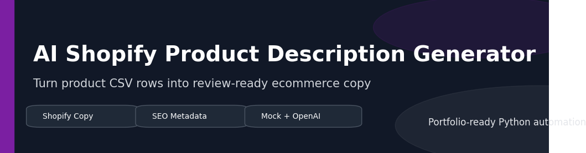
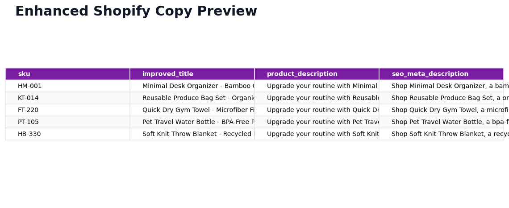

# AI Shopify Product Description Generator




Client-style ecommerce automation for Shopify sellers who need consistent product titles, descriptions, bullet points, and SEO metadata from a product CSV.

The project runs immediately in mock mode without an API key, which makes it easy to review in a public portfolio. When `OPENAI_API_KEY` is provided, the same workflow can use OpenAI mode for AI-generated product copy.

## Visual Preview



| Asset | Link |
| --- | --- |
| Architecture diagram | [docs/architecture.md](docs/architecture.md) |
| Workflow diagram | [docs/workflow.md](docs/workflow.md) |
| Sample output guide | [docs/sample_outputs.md](docs/sample_outputs.md) |
| Client delivery notes | [docs/client_delivery_notes.md](docs/client_delivery_notes.md) |

## Client Problem

Shopify sellers often have product spreadsheets with basic product facts but weak listing copy. Manually rewriting titles, descriptions, feature bullets, and SEO metadata for dozens or hundreds of products is slow and inconsistent.

This project demonstrates a repeatable content-generation workflow that turns structured product data into review-ready ecommerce copy.

## Delivered Solution

- Product CSV reader
- Improved product title generation
- Shopify-ready description generation
- Bullet point feature generation
- SEO meta description generation
- Mock mode for no-key demos and testing
- Optional OpenAI mode for API-backed generation
- Enhanced CSV export for review or Shopify import preparation
- `.env.example` for safe credential setup
- Logging and error handling for handoff

## Project Structure

```text
ai-shopify-product-description-generator/
  main.py
  requirements.txt
  README.md
  portfolio_description.md
  docs/
    architecture.md
    workflow.md
    sample_outputs.md
    client_delivery_notes.md
  assets/
    banner.png
    architecture_diagram.png
    workflow_diagram.png
  sample_data/
    products.csv
  output/
    enhanced_products.csv
  screenshots/
    sample_output_preview.png
  .env.example
```

## Setup

```powershell
python -m venv .venv
.\.venv\Scripts\Activate.ps1
pip install -r requirements.txt
```

If running from the repository root, install the shared dependency file:

```powershell
pip install -r requirements.txt
```

## Usage

Run without an API key:

```powershell
python main.py --mode mock
```

Auto mode uses OpenAI only when `OPENAI_API_KEY` exists:

```powershell
python main.py
```

Optional OpenAI mode:

```powershell
copy .env.example .env
# Edit .env and set OPENAI_API_KEY
python main.py --mode openai --model gpt-4o-mini
```

Use custom paths:

```powershell
python main.py --input "sample_data/products.csv" --output "output/enhanced_products.csv" --mode mock
```

## Input Format

Required CSV columns:

```text
sku,title,category,material,features,target_customer
```

Use semicolons inside the `features` field:

```text
five compartments;phone slot;smooth finish
```

## Outputs

```text
output/enhanced_products.csv
output/run.log
```

Output columns:

| Column | Description |
| --- | --- |
| `sku` | Source product SKU |
| `original_title` | Original product title |
| `improved_title` | Generated listing title |
| `product_description` | Generated ecommerce description |
| `bullet_point_features` | Generated feature bullets |
| `seo_meta_description` | Generated SEO meta description |

## Validation

```powershell
python -m py_compile main.py
python main.py --mode mock
```

Successful run criteria:

- Product CSV loads successfully
- Enhanced CSV is generated
- Output includes all generated copy columns
- Runtime log reports the selected generation mode and product count

## Example Client Applications

- Shopify product listing refresh
- SEO metadata preparation before product import
- Product catalog copy standardization
- Amazon, Etsy, WooCommerce, or PIM copy drafting
- Bulk copy generation for ecommerce teams to review

## Security and Credentials

Mock mode requires no credentials. OpenAI mode reads `OPENAI_API_KEY` from the local environment or `.env`. Do not commit `.env` or real API keys.

## Known Limits

- Mock mode is deterministic and intended for demos, testing, and workflow review.
- OpenAI mode requires a valid API key and may incur API usage costs.
- Generated copy should be reviewed before publishing to a live storefront.

## Upgrade Ideas

- Brand voice templates
- Product category-specific prompts
- Shopify CSV import mapping
- Multilingual copy generation
- Human review status columns
- Bulk image alt text generation
