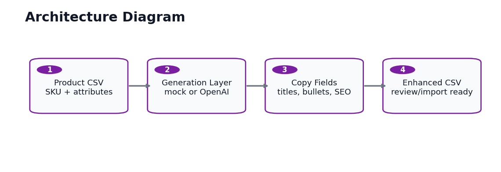
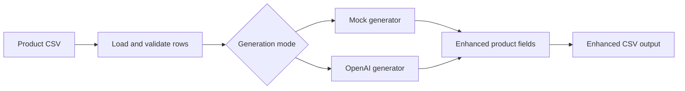

# Architecture Diagram

## Components

| Layer | Responsibility |
| --- | --- |
| Product CSV | Contains SKU, title, category, material, features, and target customer fields |
| Generation layer | Uses mock generation for public demos or OpenAI mode when an API key is provided |
| Copy fields | Produces improved titles, product descriptions, feature bullets, and SEO metadata |
| Output layer | Exports an enhanced CSV for review or ecommerce import preparation |

## Data Flow

## Client Notes

Mock mode makes the workflow safe to demonstrate publicly. OpenAI mode can be enabled for client work by adding `OPENAI_API_KEY` locally without committing secrets.
