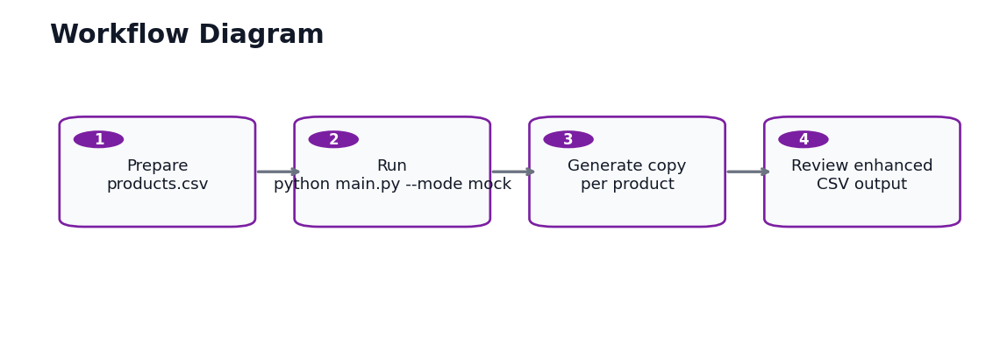

# Workflow Diagram



## Operator Workflow

1. Prepare `sample_data/products.csv`.
2. Run `python main.py --mode mock` for a no-key demo.
3. The script generates ecommerce copy for each product row.
4. Review `output/enhanced_products.csv` before importing or publishing.

## Commands

```powershell
python main.py --mode mock
python main.py --input "sample_data/products.csv" --output "output/enhanced_products.csv" --mode mock
```

Optional OpenAI mode:

```powershell
python main.py --mode openai --model gpt-4o-mini
```

## Handoff Checklist

- Confirm the input CSV contains all required columns.
- Confirm the desired brand voice before production generation.
- Review generated copy before publishing live product listings.
- Never commit `.env` or real API keys.
